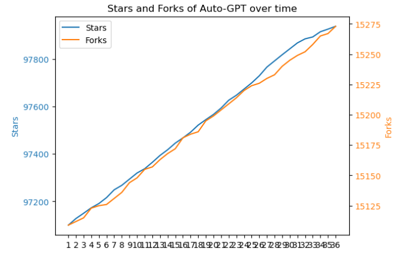

**Write a python script to tack the number of stars and forks of the Significant-Gravitas Auto-GPT project  on GitHub
using the GitHub API and record the hourly values in a sqlite database**

    To track the number of stars and forks of the Significant-Gravitas Auto-GPT project
    on GitHub using the GitHub API and record the hourly values in a sqlite database,
    we can use the following Python script:

```python
import sqlite3
import requests
import time

# Set up the database
conn = sqlite3.connect('github_stats.db')
c = conn.cursor()
c.execute('''CREATE TABLE IF NOT EXISTS stats
             (datetime TEXT, stars INTEGER, forks INTEGER)''')

# Define the GitHub API endpoint and parameters
endpoint = 'https://api.github.com/repos/Significant-Gravitas/Auto-GPT'
headers = {'Accept': 'application/vnd.github.v3+json'}

# Loop indefinitely
while True:
    # Make a request to the GitHub API
    response = requests.get(endpoint, headers=headers)

    # Check if the request was successful
    if response.status_code == 200:
        # Extract the number of stars and forks
        data = response.json()
        stars = data['stargazers_count']
        forks = data['forks_count']

        # Record the values in the database
        now = time.strftime('%Y-%m-%d %H:%M:%S')
        c.execute("INSERT INTO stats VALUES (?, ?, ?)", (now, stars, forks))
        conn.commit()

        # Wait for an hour before making the next request
        time.sleep(3600)
    else:
        # If the request was unsuccessful, print an error message and wait for 10 minutes before trying again
        print('Error: {}'.format(response.status_code))
        time.sleep(600)
```

    This script uses the requests library to make requests to the GitHub API,
    and the sqlite3 library to create and update a SQLite database.
    
    It starts by creating a database table if it does not already exist,
    with columns for the datetime, number of stars, and number of forks.

    It then enters an infinite loop, making a request to the GitHub API every hour.
    If the request is successful, it extracts the number of stars and forks from the response,
    records them in the database along with the current datetime,
    and waits for an hour before making the next request.

    If the request is unsuccessful, it prints an error message
    and waits for 10 minutes before trying again.

    This script can be run in the background using a tool like screen or tmux
    to record the hourly stats of the Significant-Gravitas Auto-GPT project on GitHub.

**Write some python code to show a plot of the stars and forks against time.**

    To show a plot of the stars and forks against time, we can use the following Python code:

```python
import sqlite3
import matplotlib.pyplot as plt

# Connect to the database
conn = sqlite3.connect('github_stats.db')
c = conn.cursor()

# Retrieve the data from the database
c.execute("SELECT datetime, stars, forks FROM stats")
data = c.fetchall()

# Extract the datetime, stars, and forks from the data
datetimes = [row[0] for row in data]
stars = [row[1] for row in data]
forks = [row[2] for row in data]

# Create a plot of stars and forks against time
plt.plot(datetimes, stars, label='Stars')
plt.plot(datetimes, forks, label='Forks')
plt.xlabel('Datetime')
plt.ylabel('Count')
plt.title('Stars and Forks of Auto-GPT over time')
plt.legend()
plt.show()
```

    This code uses the sqlite3 library to connect to the SQLite database, and the matplotlib library to create the plot.
    It first retrieves the data from the database using a SQL query, and then extracts the datetime, stars, and forks
    from the data into separate lists.

    It then creates a plot with the plot() function of matplotlib, plotting the stars and forks against the datetime.
    It sets the x-axis label to "Datetime", the y-axis label to "Count", and the title to "Stars and Forks of Auto-GPT over time".
    It also adds a legend to the plot, showing the labels for the stars and forks lines.

    Finally, it shows the plot using the show() function of matplotlib.
    This code should display a plot of the stars and forks of the Auto-GPT project over time.

**Change the plotting code to use separate y-axis labels for the stars and forks,
and replace the datetime labels with small integers**

    To use separate y-axis labels for the stars and forks, and replace the datetime labels with small integers,
    we can modify the previous code as follows:

```python
import sqlite3
import matplotlib.pyplot as plt

# Connect to the database
conn = sqlite3.connect('github_stats.db')
c = conn.cursor()

# Retrieve the data from the database
c.execute("SELECT datetime, stars, forks FROM stats")
data = c.fetchall()

# Extract the stars and forks from the data
stars = [row[1] for row in data]
forks = [row[2] for row in data]

# Create a list of integers for the x-axis labels
x_labels = list(range(1, len(stars) + 1))

# Create a figure with two y-axes
fig, ax1 = plt.subplots()
ax2 = ax1.twinx()

# Plot the stars on the first y-axis
ax1.plot(x_labels, stars, color='tab:blue', label='Stars')
ax1.set_ylabel('Stars', color='tab:blue')
ax1.tick_params(axis='y', labelcolor='tab:blue')

# Plot the forks on the second y-axis
ax2.plot(x_labels, forks, color='tab:orange', label='Forks')
ax2.set_ylabel('Forks', color='tab:orange')
ax2.tick_params(axis='y', labelcolor='tab:orange')

# Set the x-axis labels and title
plt.xticks(x_labels)
plt.xlabel('Time')
plt.title('Stars and Forks of Auto-GPT over time')

# Add a legend to the plot
lines, labels = ax1.get_legend_handles_labels()
lines2, labels2 = ax2.get_legend_handles_labels()
ax2.legend(lines + lines2, labels + labels2, loc='best')

# Show the plot
plt.show()
```

    In this modified code, we first retrieve the stars and forks from the data
    and create a list of integers for the x-axis labels.

    We then create a figure with two y-axes using the subplots() function of matplotlib.
    We plot the stars on the first y-axis using ax1.plot() and set the y-axis label to "Stars" with ax1.set_ylabel().
    We also set the color of the line and y-axis label to blue, and the tick label color to match.

    We plot the forks on the second y-axis using ax2.plot() and set the y-axis label to "Forks" with ax2.set_ylabel().
    We also set the color of the line and y-axis label to orange, and the tick label color to match.

    We set the x-axis labels to the list of integers using plt.xticks(), and set the x-axis label to "Time"
    and the title to "Stars and Forks of Auto-GPT over time" using plt.xlabel() and plt.title().

    Finally, we add a legend to the plot using ax1.get_legend_handles_labels() and ax2.get_legend_handles_labels()
    to combine the legend labels and lines for both y-axes.

    We then show the plot using plt.show(). This modified code should display a plot of the stars and forks
    of the Auto-GPT project over time, with separate y-axis labels and integer x-axis labels.

And here's a sample plot:
    



